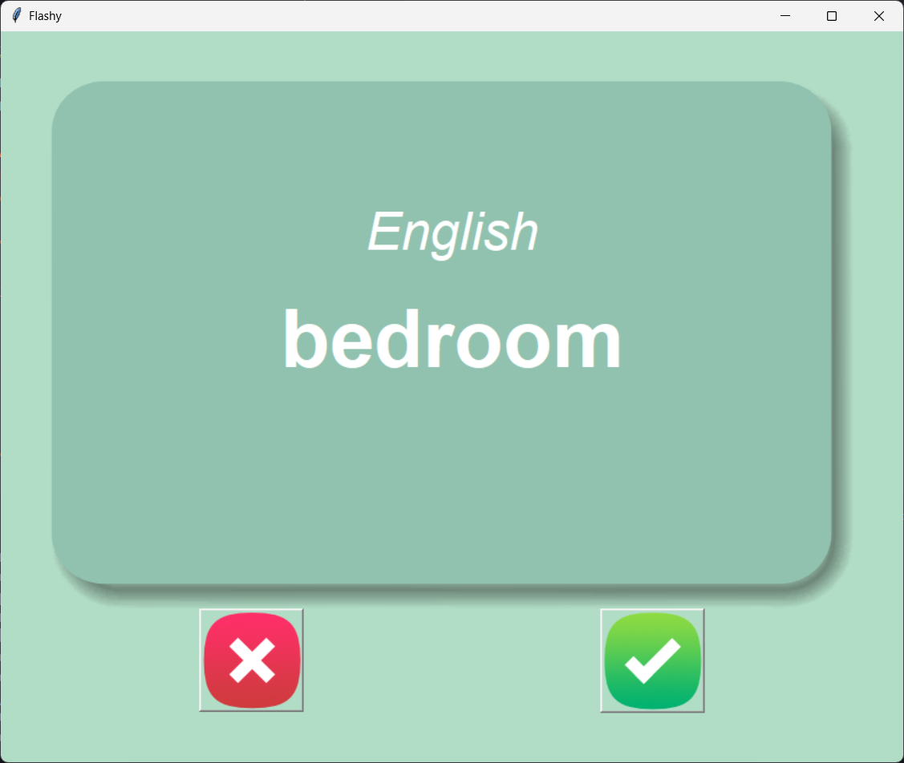

## Flashcard French to English Trainer

This Python project helps you learn French vocabulary with a user-friendly flashcard application built using Tkinter. It displays a French word on the front side and automatically flips to its English translation after a few seconds.

**Features:**

-  **Automatic Card Flipping:** Configurable delay for automatic transition from French to English.
-  **Interactive Learning:**
   -  **Right Button:** Click to remove the current word from the deck and move on if you know it.
   -  **Wrong Button:** Click to see the English translation and continue with the current word if unsure.
-  **Data Source:** Utilizes a CSV file containing French words and their English translations.

**Screenshots:**

Front Card Image: 


Back Card Image:


**Requirements:**

-  Python 3 (with Tkinter library included)

**Installation:**

1. Clone this repository:

   ```bash
   git clone [https://github.com/your-username/flashcard.git](https://github.com/your-username/flashcard.git)
   ```

2. Run the main script:

   ````bash
    python main.py
    ```
   **Usage:**
   ````

-  Ensure you have a CSV file named french_words.csv in the project directory. The CSV file should have two columns:

   -  French Word (first column)
   -  English Translation (second column)

**Customization:**

-  Delay: Modify the flip_delay variable (in seconds) in flash_card.py to adjust the automatic card flip timing.
-  Vocabulary Set: Update the french_words.csv with your desired vocabulary.

**Example CSV File:**

**Code snippet**

```
bonjour,hello
merci,thank you
s'il vous plaît,please
au revoir,goodbye
comment allez-vous?,how are you?
Use code with caution.
content_copy
```

**Additional Notes:**

-  Consider adding features like:
   -  Progress tracking
   -  Synonym/antonym display
   -  Scoring system
-  Implement error handling for missing CSV files or invalid data formats.
-  Write unit tests for code robustness and maintainability.

This project provides a foundation for learning and practicing French vocabulary. Feel free to explore and enhance it further!
